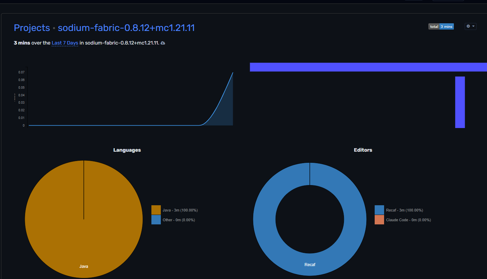

# Recaf WakaTime

A [Recaf](https://github.com/Col-E/Recaf) `4.X` plugin that logs the time you spend reverse‑engineering with [WakaTime](https://wakatime.com). The class you're reading or editing shows up on your WakaTime dashboard, grouped by the workspace it came from.



## How it works

Heartbeats are throttled to at most one every two minutes per file, exactly as the WakaTime spec describes, so idle time isn't counted. Each workspace's jar name becomes the WakaTime **project**, and the language is reported as **Java**.

The first time it runs, the plugin downloads `wakatime-cli` into `~/.wakatime/` and keeps it up to date — the same shared CLI and config used by every WakaTime editor plugin. Nothing else is bundled.

## Setup

You need a WakaTime account and API key (free): https://wakatime.com/settings/api-key

The key is read from `~/.wakatime.cfg`, shared with all your other WakaTime plugins. If no key is found, the plugin asks for it once on startup and writes it there. 

## Building

Build with Gradle (requires **JDK 22+**, the same as Recaf):

```bash
./gradlew build
```

This produces `build/libs/recaf-wakatime-1.0.0.jar`. Drop it into your Recaf `plugins` directory:

| OS      | Location                                      |
| ------- | --------------------------------------------- |
| Windows | `%APPDATA%\Recaf\plugins`                     |
| Linux   | `~/.config/Recaf/plugins`                     |
| macOS   | `~/Library/Application Support/Recaf/plugins` |

Then start Recaf, open a workspace, and your time starts logging.

> You can also launch Recaf with the plugin already loaded straight from this project:
> ```bash
> ./gradlew runRecaf
> ```


